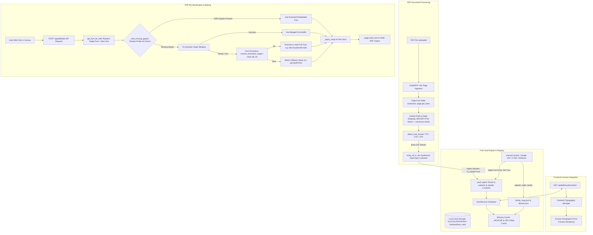
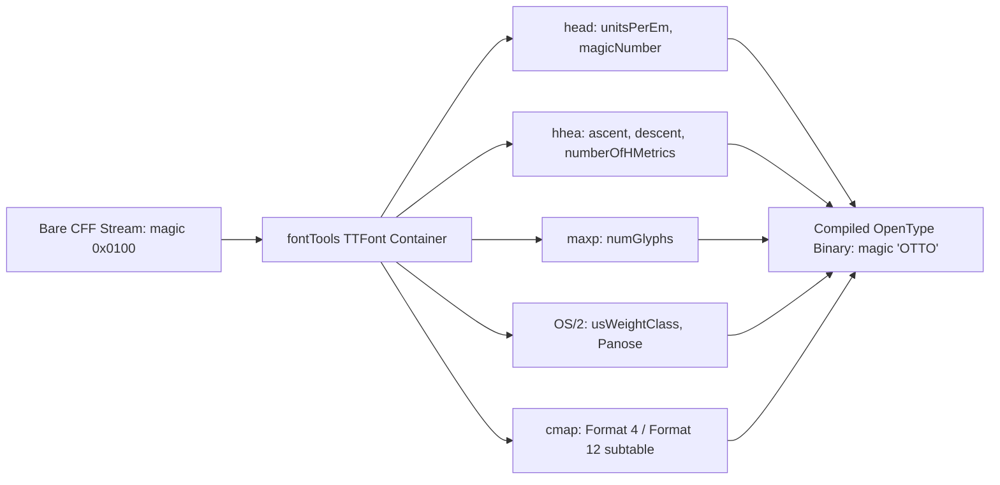
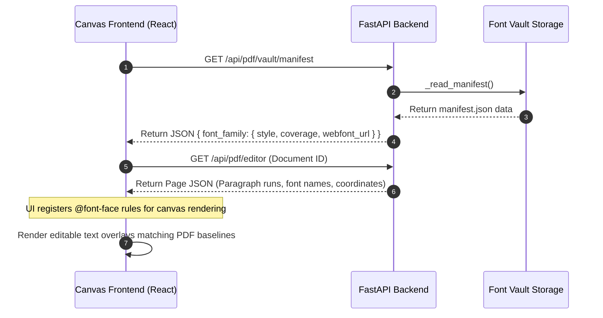
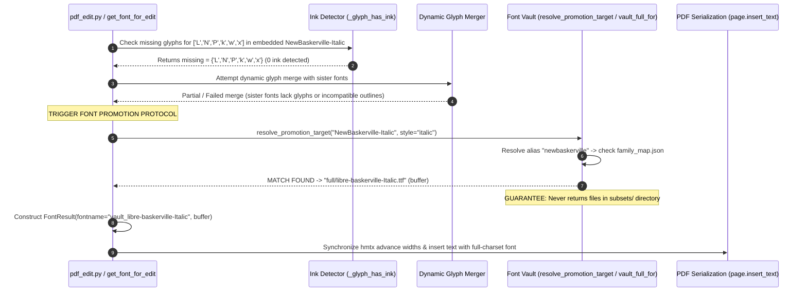

# Font Vault & Typography Pipeline Architecture Specification

> **Document Version**: 2.1.0  
> **Last Updated**: August 7, 2026  
> **Status**: Production Architecture Reference  
> **Module Location**: `backend/converter/font_vault.py` & `backend/converter/font_utils.py`

---

## Executive Summary

The **Font Vault & Typography Pipeline** is the core rendering, font extraction, font promotion, and glyph resolution engine for the PDF Editor. PDF documents frequently embed heavily subsetted fonts containing only the specific characters present in the original document. When a user edits text or adds new characters, these subsetted fonts fail, causing missing character boxes (`.notdef` GID 0), misaligned letter spacing, or font substitution corruption.

This architecture specification details how the system:
1. **Ingests & Stores** fonts from embedded PDFs, Google Fonts API, CTAN TeX Gyre, and Windows System/Office font directories into a unified vault with isolated directory routing (`full/`, `subsets/`, `buffers/`).
2. **Maps & Resolves Aliases** via static lookup tables (`family_map.json`, `aliases.json`, `resolve_root_family()`, `resolve_promotion_target()`).
3. **Detects & Extracts** embedded fonts from PDF files and converts bare CFF font streams into valid OpenType (`.otf`) font containers.
4. **Communicates** font availability and typography manifests with the canvas frontend editor.
5. **Handles Missing Glyphs & Promotes Fonts** dynamically (e.g., promoting a subsetted `NewBaskerville-Italic` lacking `['L','N','P','k','w','x']` to a metric-compatible full-charset vault font like `libre-baskerville-Italic`), guaranteeing that subset font buffers are **never** returned as full promotion targets.
6. **Serializes & Bakes** edits into the final PDF output while maintaining 100% visual consistency and letter-spacing metric fidelity (`hmtx` synchronization).

---

## 1. System Architecture Overview



---

## 2. File Sitemap & Architectural Roles

| File Path | Role & Architectural Responsibilities | Key Functions / Classes |
| :--- | :--- | :--- |
| [`backend/converter/font_vault.py`](file:///c:/Users/Paradox-Labs/Documents/Projects/Writing_Tools_Production/backend/converter/font_vault.py) | **Central Vault Storage Manager**. Controls thread-safe manifest & registry read/writes (`_LOCK`), isolated storage routing (`full/`, `subsets/`, `buffers/`), SHA-256 buffer hashing (`_font_id`), character range unioning (`_to_ranges`), static family registration (`register_static_family`), alias resolution (`resolve_root_family`), promotion resolution (`resolve_promotion_target`), LRU CMap caching (`_cached_cmap`), and batch ingestion context management (`vault_batch_write`). | `vault_ingest()`, `vault_full_for()`, `vault_cover_for()`, `register_static_family()`, `resolve_root_family()`, `resolve_promotion_target()`, `_write_manifest()`, `vault_batch_write` |
| [`backend/converter/font_utils.py`](file:///c:/Users/Paradox-Labs/Documents/Projects/Writing_Tools_Production/backend/converter/font_utils.py) | **Typography Utility Engine**. Handles font extraction from PDF byte streams, normalized canonical family resolution (`canonical_family` with space/hyphen stripping), magic-byte format detection (`detect_font_format`), CFF-to-OTF shell wrapping (`wrap_cff_in_otf`), CMap injection & `hmtx` advance-width synchronization (`_inject_cmap`), render-probe ink detection (`_glyph_has_ink`), and multi-tier font promotion / fallback resolution (`get_font_for_edit`). | `get_font_for_edit()`, `_find_missing_glyphs()`, `_glyph_has_ink()`, `wrap_cff_in_otf()`, `_inject_cmap()`, `canonical_family()` |
| [`backend/converter/pdf_edit.py`](file:///c:/Users/Paradox-Labs/Documents/Projects/Writing_Tools_Production/backend/converter/pdf_edit.py) | **PDF Paragraph & Page Editor**. Extracts paragraph blocks, bounding rects, run origins, font sizes, and colors; redacts old text runs and invokes `get_font_for_edit()` during document baking. | `_span_runs_in_rect()`, `bake_pdf_edits()`, `_normalize_color_rgb()` |
| [`backend/routes/pdf_routes.py`](file:///c:/Users/Paradox-Labs/Documents/Projects/Writing_Tools_Production/backend/routes/pdf_routes.py) | **FastAPI Controller Endpoint Layer**. Exposes font manifest data (`/api/pdf/vault/manifest`), document structure endpoints, and edit/bake execution routes to the React frontend. | `get_vault_manifest()`, `bake_pdf()` |
| [`tools/fetch_fonts.py`](file:///c:/Users/Paradox-Labs/Documents/Projects/Writing_Tools_Production/tools/fetch_fonts.py) | **Static & API Font Harvester**. Downloads static fallbacks (Libre Baskerville), CTAN TeX Gyre fonts (Termes, Pagella, Heros, Cursor), and queries Google Fonts API using `GOOGLE_FONT_API_KEY` for 14 workhorse font families; registers static mapping via `register_static_family()`. | `fetch_all_fonts()`, `fetch_google_fonts()`, `load_env_file()` |
| [`tools/ingest_system_font.py`](file:///c:/Users/Paradox-Labs/Documents/Projects/Writing_Tools_Production/tools/ingest_system_font.py) | **Windows System & Office Font Harvester**. Scans `C:\Windows\Fonts`, `%LOCALAPPDATA%\Microsoft\Windows\Fonts`, and Microsoft Office VFS caches for authentic Microsoft fonts (Arial, Times New Roman, Calibri, Cambria, Georgia, etc.); registers static mapping via `register_static_family()`. | `ingest_system_fonts()`, `parse_windows_font_style()`, `get_search_dirs()` |
| [`tools/wipe_vault.py`](file:///c:/Users/Paradox-Labs/Documents/Projects/Writing_Tools_Production/tools/wipe_vault.py) | **Vault Purging & Admin Utility**. Safely purges `%LOCALAPPDATA%\pdf_editor_font_vault` and project `backend/font_vault`, handling Windows read-only file permission locks. | `wipe_vault()`, `remove_readonly()` |

---

## 3. Font Ingestion & Storage Architecture

### 3.1 Physical Directory Structure & Isolated Routing
The vault operates from `%LOCALAPPDATA%\pdf_editor_font_vault` (with a repository backup directory at `backend/font_vault`):

```
pdf_editor_font_vault/
├── manifest.json              # Central database mapping family_style keys
├── family_map.json            # Static lookup mapping root family + style -> full font file
├── aliases.json               # Alias resolution table mapping font aliases -> root family
├── full/                      # Complete compiled .ttf and .otf font binaries (PROMOTION TARGETS)
│   ├── libre-baskerville-Regular.ttf
│   ├── libre-baskerville-Italic.ttf
│   ├── libre-baskerville-Bold.ttf
│   ├── arial.ttf
│   ├── timesbd.ttf
│   └── ... (225 total compiled fonts)
├── subsets/                   # Extracted PDF subset font binaries (.otf/.ttf) (ISOLATED)
│   ├── emb_NewBaskerville-Roman_a1f4.otf
│   └── ...
└── buffers/                   # Temporary / unclassified font buffers
```

#### Ingestion Storage Routing (`vault_ingest`)
- `is_subset=True`: Saved strictly to `subsets/{basename}.{fmt}` and registered under `e["subsets"]`. **Never returned for full font promotion**.
- `full=True`: Saved to `full/{basename}` and registered under `e["full_font"]`.
- `full=False`, `is_subset=False`: Saved to `buffers/{basename}.{fmt}` and registered under `e["sources"]`.

---

### 3.2 Static Mapping & Alias Lookup System

#### `family_map.json`
Maps root family keys to specific font files by style variant:
```json
{
  "newbaskerville": {
    "regular": "full/libre-baskerville-Regular.ttf",
    "italic": "full/libre-baskerville-Italic.ttf",
    "bold": "full/libre-baskerville-Bold.ttf"
  },
  "arial": {
    "regular": "full/arial.ttf",
    "bold": "full/arialbd.ttf",
    "italic": "full/ariali.ttf",
    "bolditalic": "full/arialbi.ttf"
  }
}
```

#### `aliases.json`
Maps font name aliases to canonical root families:
```json
{
  "librebaskerville": "newbaskerville",
  "timesnewroman": "times",
  "bookantiqua": "palatino",
  "helveticaneue": "helvetica"
}
```

#### Alias Resolution (`resolve_root_family`)
`resolve_root_family(family)` follows alias links up to 3 hops with cycle protection to resolve any variant or alias (e.g. `"Libre Baskerville"` $\rightarrow$ `"librebaskerville"` $\rightarrow$ `"newbaskerville"`).

#### Promotion Target Lookup (`resolve_promotion_target`)
`resolve_promotion_target(family, style="regular")` performs a fast, deterministic static-table lookup against `aliases.json` and `family_map.json`, returning `(font_name, font_bytes, root_family)` for font promotion.

---

### 3.3 Manifest Schema (`manifest.json`)
Entries in `manifest.json` are keyed by family and style variant (`fam_key = f"{fam}_{st}"`), preventing variant collision between Regular, Bold, Italic, and BoldItalic styles.

```json
{
  "newbaskerville_regular": {
    "coverage": [[32, 126], [160, 255], [8211, 8222]],
    "sources": [],
    "subsets": ["emb_NewBaskerville-Roman_a1f4"],
    "full_font": "full/libre-baskerville-Regular.ttf",
    "stem_vw_ratio": 0.082,
    "format": "ttf",
    "license": "OFL",
    "stand_in_for": "NewBaskerville-Roman",
    "style": "regular",
    "buffer_id": "9a4f21b7c8e01234",
    "added_at": "2026-08-07T12:30:00.000000"
  },
  "newbaskerville_italic": {
    "coverage": [[32, 126], [160, 255]],
    "sources": [],
    "subsets": ["emb_NewBaskerville-Italic_b8e2"],
    "full_font": "full/libre-baskerville-Italic.ttf",
    "stem_vw_ratio": 0.078,
    "format": "ttf",
    "license": "OFL",
    "stand_in_for": "NewBaskerville-Italic",
    "style": "italic",
    "buffer_id": "1b2c3d4e5f6a7b8c",
    "added_at": "2026-08-07T12:30:00.000000"
  }
}
```

---

## 4. PDF Font Extraction & Format Synthesis

When a PDF is loaded, PyMuPDF exposes font metadata via `page.get_fonts(full=True)`.

### 4.1 Normalized Canonical Family Resolution
The pipeline strips subset prefixes, style suffixes, spaces, hyphens, and underscores via `canonical_family()`:

```python
def canonical_family(name: str) -> str:
    n = name or ""
    n = _PREFIX_RE.sub("", n)                 # emb_, F1_, g_d0_ ...
    n = re.sub(r"^[A-Z]{6}\+", "", n)         # OPYJSL+
    n = _STYLE_RE.sub("", n)                  # -Roman/-Bold/...
    n = re.sub(r"[-_\s]+", "", n)             # "Libre Baskerville" -> "librebaskerville"
    return n.lower().strip()
```

Examples:
- `OPYJSL+HelveticaNeueLTStd-Bd` $\longrightarrow$ `helveticaneueltstd`
- `"Libre Baskerville"` $\longrightarrow$ `librebaskerville` $\longrightarrow$ `newbaskerville` (via `aliases.json`)

---

### 4.2 CFF-to-OTF Shell Wrapping (`wrap_cff_in_otf`)
When magic-byte detection (`detect_font_format()`) identifies a bare `cff` header (`0x0100`), `wrap_cff_in_otf()` dynamically synthesizes required OpenType tables:



---

## 5. Frontend & Canvas Communication



---

## 6. Missing Glyph Handling & Font Promotion Protocol

### 6.1 The Render-Probe Ink Detector (`_glyph_has_ink`)
**Problem**: Subset PDF generators frequently map missing characters to `.notdef` (GID 0) inside the font CMap table while retaining the codepoint index. Relying solely on `font.has_glyph(ord(ch))` produces **false positives** (claiming a character is present when it actually renders as an empty box or missing symbol).

**Solution**: The pipeline uses an empirical render-probe ink check:

```python
def _glyph_has_ink(font_buffer: bytes, ch: str, fontsize: int = 20) -> bool:
    """Renders candidate character on a temporary 40x40 canvas.
    Returns True iff non-white pixel ink is detected."""
    doc = fitz.open()
    page = doc.new_page(width=40, height=40)
    page.insert_font(fontname="p", fontbuffer=font_buffer)
    page.insert_text(fitz.Point(5, 28), ch, fontname="p", fontsize=fontsize)
    pix = page.get_pixmap(colors=fitz.csGRAY)
    ink_pixels = sum(1 for v in pix.samples if v < 250)
    doc.close()
    return ink_pixels > 0
```

---

### 6.2 Detailed Trace: Promoting Missing Paragraph Glyphs

Consider the user's scenario:
- **PDF Paragraph Font**: `NewBaskerville-Italic` (subset embedded in PDF).
- **User Edits Text**: Inserts new characters `['L', 'N', 'P', 'k', 'w', 'x']`.

#### Execution Step-by-Step



1. **Detection**: `_find_missing_glyphs()` executes `_glyph_has_ink()` for every character in the edited text. It discovers that `['L','N','P','k','w','x']` render with zero ink in the embedded `NewBaskerville-Italic` subset.
2. **Attempt Dynamic Merge**: `merge_missing_glyphs()` attempts to extract character outlines from other subset fonts in the document. If glyph outlines cannot be grafted cleanly, it logs:
   ```
   GLYPH-DETECTOR: subset font lacks ink for ['L', 'N', 'P', 'k', 'w', 'x']
   Glyph merge failed/partial. Initiating vault promotion...
   ```
3. **Vault Match & Promotion**:
   - `get_font_for_edit()` calls `resolve_promotion_target("NewBaskerville-Italic", style="italic")` (or `vault_full_for`).
   - `resolve_root_family("NewBaskerville-Italic")` maps to `"newbaskerville"`.
   - `family_map.json` returns `full/libre-baskerville-Italic.ttf`.
   - The vault verifies that `full/libre-baskerville-Italic.ttf` is located in `full/` (NOT `subsets/`) and contains 100% glyph coverage for `['L','N','P','k','w','x']`.
   - `get_font_for_edit()` returns:
     ```python
     FontResult(
         fontname="vault_libre-baskerville-Italic",
         font_buffer=b"...", # Full 100KB Libre Baskerville Italic TTF buffer
         fallback_used=True,
         fallback_reason="vault:libre-baskerville-Italic"
     )
     ```
4. **Bake Execution**: The PDF editor replaces the paragraph run using the full-charset `libre-baskerville-Italic` font binary. The text renders crisply without missing glyph boxes.

---

## 7. Multi-Tier Resolution & Fallback Hierarchy

When resolving a font for editing, the system enforces a strict **6-Tier Resolution Fallback Chain**:

```
Tier 1: Extracted PDF Embedded Subset (if 100% glyph ink coverage)
   │
   ├── [Lacks Glyphs] ──► Tier 2: Dynamic Glyph Merging (graft missing glyphs into container)
   │                         │
   │                         └── [Failed] ──► Tier 3: Static Vault Full Font Match (resolve_promotion_target / vault_full_for)
   │                                             │   Exact family + style match (e.g. libre-baskerville-Italic from full/)
   │                                             │
   │                                             └── [Miss] ──► Tier 4: Vault Union Subset Coverage (vault_cover_for)
   │                                                                 │   Aggregate coverage across all ingested subsets
   │                                                                 │
   │                                                                 └── [Miss] ──► Tier 5: Metric Base-14 Alias (_match_base14)
   │                                                                                   │   Standard codes: helv, tiro, cour
   │                                                                                   │
   └── [No Embedded Font] ──────────────────────────────────────────────────────────────┴──► Tier 6: pymupdf-fonts System Fallback
                                                                                                 Ubuntu (serif), FiraGO (sans), Space Mono
```

---

## 8. Baking & Advance-Width (`hmtx`) Metric Synchronization

When inserting promoted text into the PDF via PyMuPDF:

```python
# font_utils.py: _inject_cmap()
```

1. **Character Width Extraction (`hmtx`)**: The horizontal metrics table (`hmtx`) of the replacement font is synchronized with the original PDF character spacing.
2. **Stem Darkening (`stem_vw_ratio`)**: The stem width ratio ($StdVW / \text{unitsPerEm}$) is extracted from CFF `TopDict` to ensure promoted fonts match the visual weight/thickness of the surrounding PDF text.
3. **Re-insertion**: `page.insert_text()` receives the promoted font buffer, origin baseline point, font size, and color RGB tuple, serializing clean, searchable text back into the PDF.

---

## 9. Verification & Architectural Constraints

1. **Subset Isolation**: Subsets extracted from PDFs are saved under `subsets/` and registered under `entry["subsets"]`. `vault_full_for` is explicitly guarded to **never** return subset buffers.
2. **No Silent Swallowing**: If a font lacks ink for a character, the system logs a `WARNING` and promotes to the vault.
3. **Idempotence**: Re-running ingestion scripts (`ingest_system_font.py`, `fetch_fonts.py`) does not duplicate file buffers or corrupt coverage ranges.
4. **Offline Production Bundling**: Copying `backend/font_vault` into a Docker build container guarantees 100% offline font availability in cloud production deployments.
